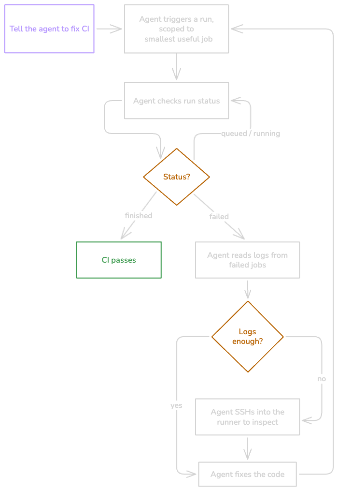

# AI in Depot CI

Depot CI leverages AI in two powerful ways:

1. **AI Failure Diagnosis** - Automatic failure analysis when jobs fail
2. **Coding Agent Integration** - Built for AI coding agents like Claude Code and Cursor

---

## AI Failure Diagnosis

When a job fails, Depot CI automatically analyzes the failure and displays a **Failure Diagnosis** section at the top of the job detail view.

### What's Included

- **What went wrong**: An AI-generated explanation of the root cause based on the job's logs and error output
- **Suggested fix**: Actionable steps to resolve the issue

### How to Access

1. Go to the [Depot CI page](https://depot.dev/orgs/_/workflows) in your dashboard
2. Click on a failed workflow run
3. Select the failed job
4. Look at the top of the job detail view for the **Failure Diagnosis** section

### Additional Debugging Options

For deeper investigation beyond AI diagnosis:

- [Debug a failing job with SSH](https://depot.dev/docs/ci/how-to-guides/debug-with-ssh) - Connect directly to the sandbox environment
- [View Depot CI logs](https://depot.dev/docs/ci/observability/depot-ci-logs) - Manual investigation with detailed logs

---

## Coding Agent Loops

Depot CI is built for programmatic use, making it a natural fit for AI coding agents. Instead of the traditional **push-wait-guess** cycle, agents can run CI locally, read failures, fix code, and rerun — all in a closed loop from the terminal.

### The Agent Loop



### Why Depot CI Works Well for Agents

| Feature | Benefit for Agents |
| :--- | :--- |
| **`depot ci run`** | Tests workflows against local working tree — no commit/push required |
| **`--job` flag** | Scope to specific jobs for faster iteration |
| **`depot ci status`** | Full run hierarchy with statuses |
| **`depot ci logs`** | Fetch log output for failed jobs |
| **`depot ci ssh`** | Connect directly to running sandboxes |
| **CLI + API** | Fully programmatic, no HTTP plumbing needed |

### Key CLI Commands for Agents

```bash
# Run workflow against local changes
depot ci run --workflow .depot/workflows/ci.yml

# Scope to specific job for faster iteration
depot ci run --job test

# Check full run status
depot ci status

# Get logs for a failed job
depot ci logs <run-id> --job <job-name>

# SSH into running sandbox
depot ci ssh <run-id>

# Run with SSH pause after specific step
depot ci run --ssh-after-step 3
```

---

## Setting Up the Agent Loop

### Prerequisites

- Complete the Depot CI quickstart
- Run `depot login` or set `DEPOT_TOKEN` for authentication
- An AI coding agent with shell access (Claude Code, Cursor, etc.)

### Install Depot Skills

Teach your agent how to use Depot CLI commands:

```bash
npx skills add depot/skills
```

### Create a Fix-CI Command

Create a command file (e.g., `.claude/commands/fix-ci.md` or `.cursor/commands/fix-ci.md`):

```markdown
Fix a Depot CI workflow, run, or job until it passes.

### Before you start
Invoke the `depot-ci` skill to load the full CLI reference.

### Inputs
Accept any of:
- A workflow path (e.g., `.depot/workflows/ci.yml`)
- A run ID, job ID, or attempt ID
- A target job name (e.g., `build`)
- A natural-language goal (e.g., "make the test job pass")

### The Loop
1. **Run** the workflow against local changes, scoped to the smallest useful job
2. **Check status** and **read logs** for failed jobs
3. If logs aren't enough, connect with **`depot ci ssh`**
4. **Fix locally** based on what you found
5. **Rerun** until green

### Autonomy
The agent may: run workflows, inspect status/logs, SSH into runners, edit local files

Ask before: changing secrets, deploying, opening PRs, or large refactors
```

---

## Agent Permissions

For autonomous iteration, agents need permission to run `depot` commands without prompting.

### Claude Code Permissions

Add to `.claude/settings.json`:

```json
{
  "permissions": {
    "allow": ["Bash(depot *)"]
  }
}
```

### Cursor Permissions

Add to `.cursor/cli.json`:

```json
{
  "permissions": {
    "allow": ["Shell(depot)"]
  }
}
```

---

## Tips for Customizing Your Agent Loop

### Iteration Limits

Cap CI attempts (3-5 attempts) to prevent infinite loops on fundamentally broken builds.

### Log Truncation

CI logs can be long. For agents with limited context, extract only the last N lines or error output — most failures appear near the end.

### Polling

`depot ci status` returns immediately (non-blocking). Agents naturally poll by calling status in a loop.

### Human Approval Gates

Configure your agent's permission model to require approval for sensitive actions:

- Changing secrets or variables
- Deploying or releasing
- Opening pull requests
- Large refactors

### Untracked Files

`depot ci run` only includes tracked files. Use `git add` before running, or add this step to your agent loop.

---

## The End of Push-Wait-Guess CI

Traditional CI: `push → wait → guess → fix → push → wait → guess`

Depot CI with agents: `fix → run → fix → run → fix → green`

This creates a tight feedback loop where agents can iterate on fixes without:

- Polluting git history
- Waiting for external CI systems
- Guessing at the root cause

---

## References

- [Depot CI metrics - AI failure diagnosis](https://depot.dev/docs/ci/observability/depot-ci-metrics)
- [Use Depot CI in coding agent loops](https://depot.dev/docs/ci/how-to-guides/coding-agents)
- [Debug with SSH](https://depot.dev/docs/ci/how-to-guides/debug-with-ssh)
- [Depot CI logs](https://depot.dev/docs/ci/observability/depot-ci-logs)
